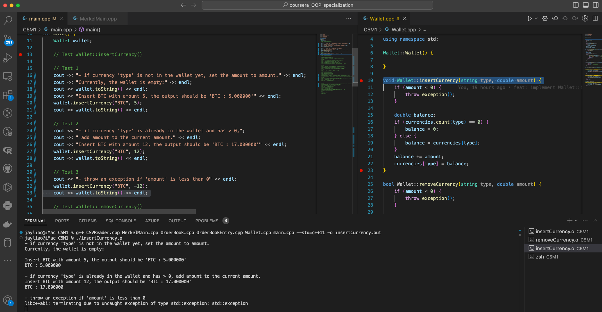
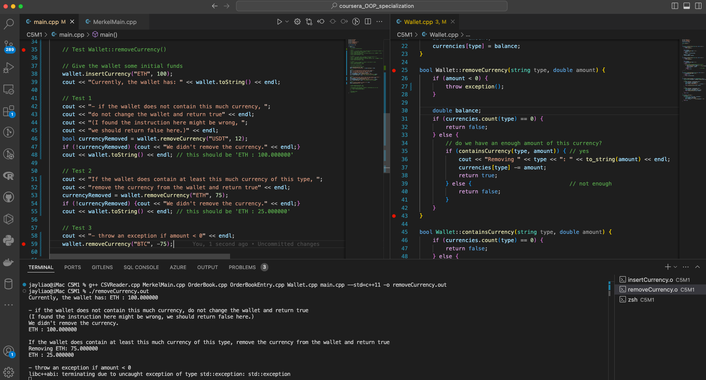
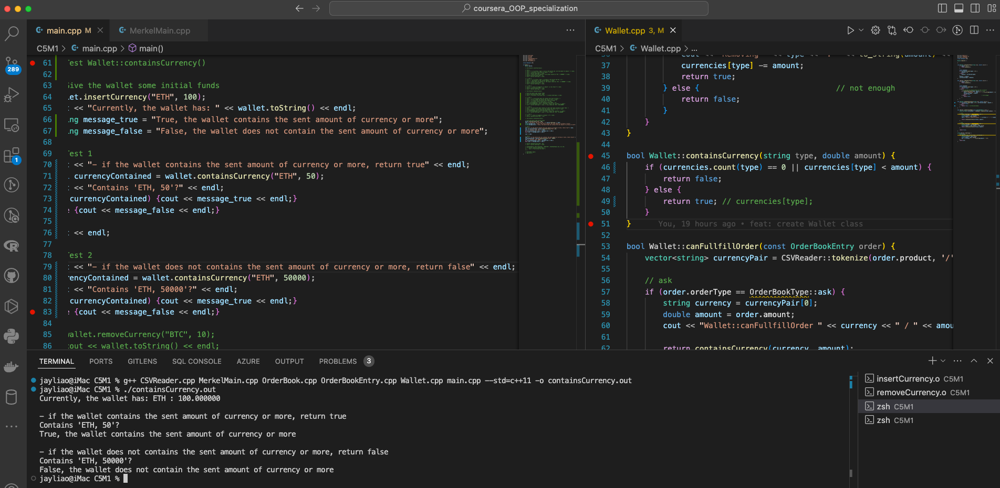

# Assignment C5 - Test the `Wallet` functions: `insertCurrency`, `removeCurrenc`y, and `containsCurrency`

## Prompt 1

Please upload a screenshot showing the insertCurrency function working. The screenshot should show the following functionality:

- if currency 'type' is not in the wallet yet, set the amount to amount
- if currency 'type' is already in the wallet and has > 0, add amount to the current amount
- throw an exception if 'amount' is less than 0

- The left chrunk contains `main.cpp` desgining the test.
- The implementation of `Wallet::insertCurrency` is on the right.
- The bottom terminal shows the testing result.

## Prompt 2

Upload a screenshot showing the removeCurrency function in action. It should show the following features:

- if the wallet does not contain this much currency, do not change the wallet and return false
- if the wallet does contain at least this much currency of this type, remove the currency from the wallet and return true
- throw an exception if amount < 0

- The left chrunk contains `main.cpp` desgining the test.
- The implementation of `Wallet::removeCurrency` is on the right.
- The bottom terminal shows the testing result.

## Prompt 3

Upload a screenshot showing containsCurrency in action. It should show the following functionality:

- if the wallet contains the sent amount of currency or more, return true
- if the wallet does not contain the sent amount of currency or more, return false

- The left chrunk contains `main.cpp` desgining the test.
- The implementation of `Wallet::containsCurrency` is on the right.
- The bottom terminal shows the testing result.
